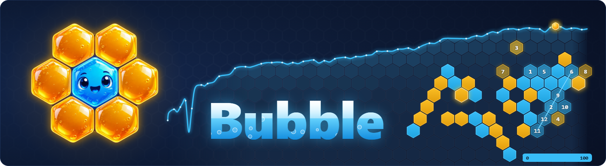

# Bubble

Bubble plays [HeXO](https://github.com/HeXO-Game/HeXO): connect six on an infinite hexagonal board, two stones per turn. It was trained from scratch by self-play on a single RTX 3070 Ti. This repository holds the bot, the play page, the training stack and the tools around them. Code and released weights are under the [MIT license](LICENSE).

## How it works

Bubble is a hex-masked residual network with a policy head and a value head. Training runs as a set of processes on one run directory, sharing one GPU:

- Actors play Bubble against itself with Gumbel MCTS. A small root search improves the policy from a few dozen simulations per stone.
- A learner trains on those games from a replay window sized the KataGo way and exports a checkpoint every few thousand steps.
- An evaluator plays every checkpoint against the champion on colour-swapped opening pairs and rates them with a Bradley-Terry model over paired results.
- A tactical solver proves forced wins. The search uses the proofs to play the shortest win and the longest defence, a position whose every move is proven lost counts as lost, and proven positions become exact training labels. The solver started as the one in [Strix](https://github.com/SootyOwl/hexo-strix) (MIT) and has been changed in many places.
- A proof pass uses spare CPU to re-check finished games for missed forced wins, labels those positions and feeds the worst misses back as starting positions.
- A dashboard shows the run.

Things that mattered, given that two stones per turn make the game tactical:

- Proven outcomes are stored on the search graph and propagate with their distance, so settled nodes are never searched again. Evaluations are shared between positions that differ only in move order.
- Value targets combine the search value, the plies remaining and the game outcome through a calibrated map. Rows with an exact label get more weight and no outcome noise.
- The opening book is a symmetry-reduced DAG with paired colour statistics. Skewed or nested openings are retired; imported off-policy and known-loss openings put the actors in positions the policy would avoid.
- Full-search rows carry the policy target, cheap-search rows only the value. Positions the network gets most wrong are resampled.
- Each evaluated opening pair is one pentanomial observation; a trial that is overtaken settles on the games it played, and anchor matches against fixed opponents keep the rating scale grounded.
- The network runs on fused Triton kernels with CUDA graphs, following advice from Vladdy, author of [Mantis Shrimp](https://github.com/Cmiller132/Hexo-Shrimp-Bot). Actors got 2.8 times faster and the learner 1.5 times.
- Actors and learner alternate in phases paced by the rows produced, and the evaluator yields while either is busy.

## Play

```sh
git clone https://github.com/Tomodovodoo/HeXO.git
cd HeXO
python -m venv .venv
```

Activate the environment (`.venv\Scripts\Activate.ps1` in PowerShell, `.venv\Scripts\activate.bat` in cmd.exe, `source .venv/bin/activate` on Linux and macOS), then:

```sh
python -m pip install -e . -r requirements/learning.txt
cmake -S . -B build -DCMAKE_BUILD_TYPE=Release
cmake --build build --config Release --parallel 2
python python/bubble.py play
```

The last command downloads the newest [released weights](https://github.com/Tomodovodoo/HeXO/releases) (4.4 MB) into `runs/play` on first use and opens the game at <http://127.0.0.1:8765>. Click a cell to place a stone, drag to pan, scroll to zoom. Either side can be a person, Bubble, the native engine or Seal, so engines can also play each other. The page shows the win estimate and candidate moves, saves evaluations, grades each turn, and imports and exports HTTTX, Rectilinear notation and links from hexo.did.science, hexo.mineking.dev and hexo.tyto.cc. Six, Strix, Shrimp and Seal appear in the engine picker with a one-click download. Details in [docs/play.md](docs/play.md).

To play a particular checkpoint or a run you trained:

```sh
python python/bubble.py play --model path/to/ema.pt
python python/bubble.py play --run runs/dense-v1
```

The engine picker lists every run under `runs/` and every model under `models/`, champion first. A GPU is used when PyTorch sees one; add `--device cpu` otherwise. The solver needs the Rust build described below; without it Bubble plays on search alone. Without any weights, `python python/play.py` serves the handwritten native engine.

Other engines go in `models/` (or `--models`), then use the rescan button in the picker: a Six folder with `sixengine.exe` and its `gen-*.onnx` networks, or a JSON entry such as `{"name": "Strix", "kind": "strix", "model": "strix.safetensors"}` next to its model file. [docs/play.md#engines](docs/play.md#engines) lists the files per engine and the entry format for Strix, Shrimp and other Six-protocol engines. Timed games, bot connections and the HTTTX HTTP and WebSocket routes are in [docs/time-controls.md](docs/time-controls.md).

## Build

Requirements: Python 3.10 or newer, CMake 3.20 or newer with a C++20 compiler, PyTorch 2.11 or newer. Install the CUDA build of PyTorch for your card from the [PyTorch selector](https://pytorch.org/get-started/locally/); `requirements/tested.txt` pins the versions used for the released weights. With MinGW on Windows, add `-G "MinGW Makefiles"` to the configure command and keep `g++` on `PATH`.

The tactical solver needs Rust and Cargo with edition 2024 support:

```sh
python tools/build_tactical.py
```

Without it the search plays without proofs and the launcher skips the proof pass. Check the build with the tests:

```sh
python -m unittest tests.test_engine tests.test_neural_search tests.test_proof tests.test_notation_api -v
python -m unittest tests.test_dense tests.test_dense_solve tests.test_openings tests.test_bubble -v
```

## Train

```sh
python python/bubble.py train --run runs/bubble
```

This creates the run and its first checkpoint, then starts the learner, four actors, the evaluator, the proof pass (once the solver is built) and the dashboard at <http://127.0.0.1:8766>. Everything the run produces stays under `runs/bubble`: game shards, checkpoints, ratings, logs.

```sh
python python/bubble.py status --run runs/bubble
python python/bubble.py stop --run runs/bubble
```

Stopping and starting again resumes from the newest checkpoint. Settings live in the run's `config.json`; `--help` on any `python/dense_*.py` script lists the flags that override them. `--net-kernels fused` enables the Triton kernels ([docs/gpu-kernels.md](docs/gpu-kernels.md)) and `--seal` rates champions against Seal once its adapter is built ([docs/native-engine.md](docs/native-engine.md)). A CPU-only run works with `--device cpu`, slowly.

## Notation

`python/notation.py` reads and writes [HTTTX notation v1](https://github.com/hex-tic-tac-toe/hexagonal-tic-tac-toe-notation/tree/15bb7877ae020d661497e332adf0810d00d24e3e), and `python/bot_api.py` serves the [HTTTX stateless bot API](https://github.com/hex-tic-tac-toe/htttx-bot-api/tree/37d2385f1016abe8b25798238a7d0c4a17a25dda/definitions) on localhost:

```sh
python python/notation.py import match.txt > match.json
python python/notation.py export match.json > match.txt
python python/bot_api.py --port 8790 --ms 100
```

A final turn may hold one stone, whether it won or the turn is still open, and the origin-only board is `version[1];`. The API's reply must carry two pieces, so it answers 409 to a first-stone win. See [docs/notation-api.md](docs/notation-api.md).

## Documentation

- [Training: value targets, cheap rows, book starts](docs/dense-training.md)
- [Evaluation: promotion, opening books, variants](docs/dense-evaluation.md)
- [Search: Gumbel MCTS, tree reuse](docs/neural-search.md)
- [Outcomes on the search graph](docs/search-outcomes.md)
- [Tactical solver and its scheduling](docs/tactical-solver.md)
- [Six: Bubble as a Six engine, Six as an opponent](docs/six-engine.md)
- [GPU kernels](docs/gpu-kernels.md)
- [Native engine, Seal adapter, tests](docs/native-engine.md)
- [Browser engine: WebGPU, WebAssembly search and solver](docs/web-engine.md)
- [Timed matches and the API](docs/time-controls.md)
- [Notation and bot API](docs/notation-api.md)
